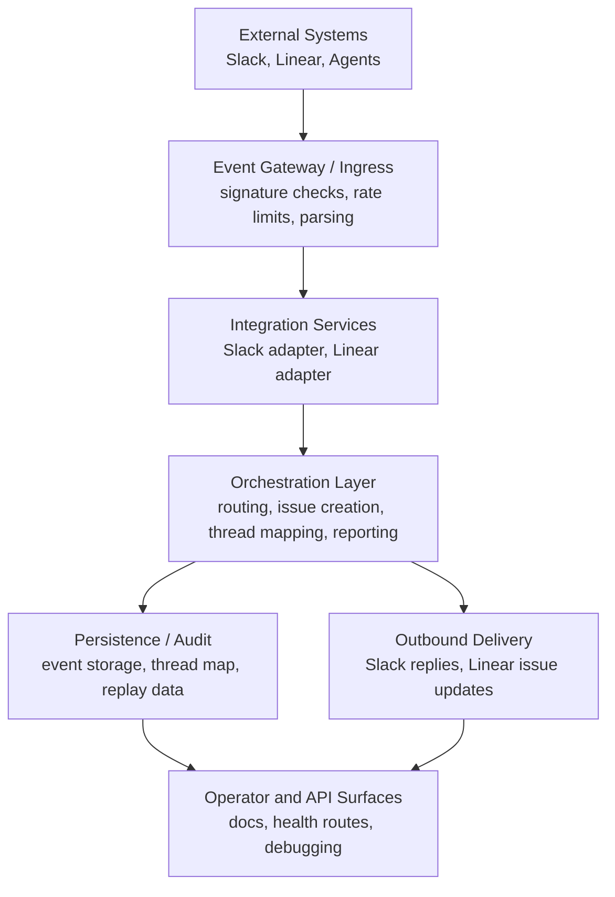

# Architecture

## System Overview

This system coordinates development work across Linear, Slack, and coding agents by treating external changes as events that move through a common orchestration path. A task update in Linear, a Slack mention, or an agent status change is received, validated, normalized, and routed to the next component instead of being handled through direct pairwise integrations.

The reason for this design is practical. Development workflows span multiple systems with different APIs, different delivery guarantees, and different failure modes. If each tool talks directly to every other tool, workflow logic becomes duplicated and difficult to reason about. An event-driven architecture creates a stable internal boundary:

- ingress receives source-specific events,
- orchestration decides what they mean,
- adapters handle external API details,
- and persistence records enough state for audit and replay.

The current repository reflects that model in two places:

- a `gateway/` service for Slack and Linear webhook handling,
- and Next.js API routes under `src/app/api/` for webhook, reporting, and health-related behavior.

## High-Level Architecture

The system is organized into a small set of distinct layers:

1. Event Gateway / Ingestion Layer
2. Integration Services
3. Processing / Orchestration Layer
4. Persistence / Audit Layer
5. Operator and API Surfaces

### Event Gateway / Ingestion Layer

This layer terminates incoming events from external systems and performs the first correctness checks.

Responsibilities:

- receive Slack events and Linear webhooks,
- validate signatures or trusted source context,
- enforce basic rate limits,
- reject unsupported or malformed payloads,
- derive correlation and deduplication identifiers,
- and hand off normalized inputs to processing logic.

Implemented examples in the repo include:

- `gateway/src/index.ts`
- `src/app/api/slack/events/route.ts`
- `src/app/api/webhooks/linear/route.ts`

### Integration Services

Integration services isolate vendor-specific API behavior from the orchestration logic.

Responsibilities:

- talk to Slack APIs for thread replies and status reporting,
- talk to Linear APIs for issue creation and webhook processing,
- maintain thread-per-issue mapping,
- and translate between external payloads and internal event semantics.

Examples in the repo:

- `src/lib/slack.ts`
- `src/lib/slack-reporting.ts`
- `src/lib/linear.ts`
- `src/lib/linear-webhook.ts`
- `src/lib/thread-map.ts`
- `gateway/src/slack.ts`
- `gateway/src/linear-webhook.ts`

### Processing / Orchestration Layer

This is the decision-making core. It consumes validated inputs and determines what should happen next.

Responsibilities:

- classify incoming events,
- decide whether an event should create work, report status, or be ignored,
- route updates to the correct Slack thread or downstream action,
- apply policy such as rate limits and anti-duplication behavior,
- and update persistent event status.

Examples in the repo:

- `src/app/api/slack/events/route.ts`
- `src/app/api/webhooks/linear/route.ts`
- `src/app/api/report/route.ts`
- `src/lib/slack-task.ts`
- `src/lib/event-storage.ts`

### Persistence / Audit Layer

The system stores just enough durable state to support correctness and debugging.

Responsibilities:

- persist received events,
- update event processing status,
- keep issue-to-thread mappings,
- preserve enough history for replay and reconciliation,
- and support local inspection during development.

Examples in the repo:

- `src/lib/event-storage.ts`
- `src/lib/thread-map.ts`
- `storage/`
- `data/linear-thread-map.example.json`

### Operator and API Surfaces

This layer exposes the system to developers and operators.

Responsibilities:

- provide HTTP endpoints for integrations,
- provide health checks and reporting routes,
- surface setup and operational documentation,
- and keep the integration model visible to humans.

Examples in the repo:

- `src/app/api/gateway/health/route.ts`
- `README.md`
- `docs/`
- `gateway/README.md`

## Component Breakdown

### Event Gateway / Ingestion Layer

What it does:

- receives raw webhook and event payloads,
- verifies request authenticity,
- and turns transport-specific inputs into valid internal requests.

Inputs:

- Slack Events API payloads
- Linear webhook payloads
- agent or internal reporting requests

Outputs:

- validated requests for orchestration
- rejected requests with explicit error responses
- stored event records for later inspection

Why it exists:

- external transport behavior should not leak into workflow logic

### Slack Integration Service

What it does:

- posts messages to Slack,
- keeps updates in the correct issue thread,
- and avoids self-triggered loops or duplicate reports.

Inputs:

- orchestration requests to notify or reply
- Slack app mention events

Outputs:

- Slack thread replies
- channel posts
- thread mapping records

Why it exists:

- Slack-specific API behavior should be isolated from the rest of the system

### Linear Integration Service

What it does:

- creates Linear issues from Slack-originated requests,
- receives Linear webhook updates,
- and converts tracker changes into downstream notifications or event records.

Inputs:

- Slack-derived task requests
- Linear webhook deliveries

Outputs:

- Linear issues
- normalized issue change events
- issue identifiers used for correlation and mapping

Why it exists:

- task lifecycle semantics are tracker-specific and should not be embedded in Slack or worker code

### Processing / Orchestration Layer

What it does:

- evaluates normalized events and determines the next action.

Inputs:

- validated Slack events
- validated Linear webhooks
- current thread map and event state

Outputs:

- Slack notifications
- Linear issue creation
- event status updates
- replayable audit history

Why it exists:

- workflow policy should be centralized instead of duplicated across integrations

### Persistence / Audit Layer

What it does:

- records received events and their final status,
- stores issue-thread mappings,
- and supports replay or manual debugging.

Inputs:

- raw or normalized event data
- processing outcomes

Outputs:

- local persistent records
- queryable event history

Why it exists:

- event-driven systems are hard to operate if they cannot explain what happened

## Data and Control Flow

Data flow and control flow are related but not identical.

### Data Flow

Data flow describes how event payloads and derived state move through the system:

1. Slack or Linear emits an event.
2. The gateway receives the payload.
3. The payload is validated and parsed.
4. Relevant identifiers and business fields are extracted.
5. The orchestration layer decides what output should be produced.
6. Slack or Linear adapters perform the downstream API call.
7. Event state is persisted for audit.

### Control Flow

Control flow describes who decides the next step:

- ingress validates,
- orchestration decides,
- adapters execute,
- persistence records.

The key point is that adapters do not own workflow policy. They implement side effects. The orchestration layer owns routing and decision-making.

### Example Control Path

1. A Slack mention arrives requesting a task.
2. The Slack route verifies the signature and parses task fields.
3. The orchestration logic builds a Linear issue description.
4. The Linear adapter creates the issue.
5. The Slack adapter posts confirmation back to the same thread.
6. The issue-thread mapping is stored for later webhook updates.

## Deployment Model

The architecture can run in more than one shape.

### Single Environment Development Model

For local development, the system can run as:

- a Next.js app exposing API routes,
- a gateway service for Slack and Linear integration behavior,
- and file-backed persistence for mappings and stored events.

This mode optimizes for transparency and low setup cost.

### Multi-Service Production Model

For production, the architecture can evolve toward:

- separate ingress services for Slack and Linear,
- a dedicated orchestration service,
- a durable queue for deferred processing,
- a shared datastore for event records and thread mappings,
- and centralized telemetry.

The conceptual architecture does not need to change for that evolution. The runtime implementation becomes more durable and more isolated.

## Architecture Diagram

## Design Principles

- Separation of concerns: ingress, orchestration, adapters, and persistence each have clear responsibilities.
- Modularity: integrations can be changed without rewriting core workflow policy.
- Loose coupling: internal control flow does not depend on one vendor payload format.
- Extensibility: new event sources or destinations can be added through adapters and routing rules.

## Summary

The system is best understood as an event orchestration layer around development workflows. Linear provides task state, Slack provides human-facing coordination, and the application routes events between them while preserving enough state for debugging and replay. The current repository already shows those boundaries, even though some pieces are still local-first and lighter-weight than a full production event platform.
