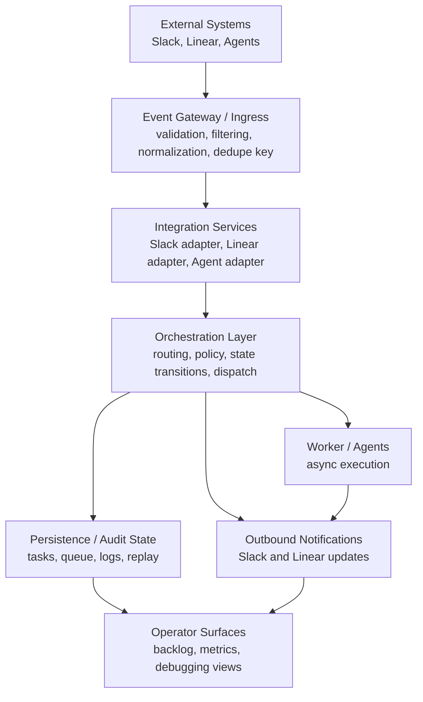

# Architecture

## System Overview

This system orchestrates development workflows across multiple tools by treating external changes as events rather than as direct API calls between point solutions. A work item update, a Slack mention, an agent result, or a task confirmation is captured as an event, interpreted by a central orchestration path, and then routed to the appropriate downstream action.

The problem being addressed is coordination, not just integration. Development work typically spans:

- a task system such as Linear for planning and state transitions,
- Slack for discussion, escalation, and operator visibility,
- and development agents or workers for execution and follow-up.

Direct integrations between every pair of tools do not scale well. They create tight coupling, duplicate business logic, and make it difficult to reason about retries, duplicate deliveries, partial failure, or auditability. An event-driven orchestration model is used instead because it introduces a stable internal processing boundary:

- upstream tools emit or trigger events,
- the system normalizes those events into an internal form,
- orchestration logic makes decisions in one place,
- and outbound actions are handled by adapters that remain specific to each tool.

That separation allows the system to evolve from a local-first runtime into a more distributed deployment without changing the conceptual model.

## High-Level Architecture

At a high level, the system is composed of four major layers:

1. Event Gateway / Ingestion Layer
2. Integration Services
3. Processing / Orchestration Layer
4. Persistence and Audit Layer

The current repository implements Slack-driven ingress, local task and backlog state, a worker path, and observability surfaces. A Linear integration fits naturally into the same architecture as an additional ingress and egress adapter.

### Event Gateway / Ingestion Layer

The gateway accepts inbound events from external systems and performs the first level of filtering and validation. Its purpose is to isolate transport-specific concerns from orchestration logic.

Examples of responsibilities:

- receive Slack Socket Mode events,
- verify source context and allowed channels,
- ignore bot-generated or unsupported messages,
- derive deduplication keys,
- extract correlation identifiers such as thread or task IDs,
- translate tool-native payloads into an internal event shape.

In a future Linear integration, this same layer would terminate webhook deliveries, validate signatures, and emit normalized task lifecycle events.

### Integration Services

Integration services encapsulate the details of talking to specific external systems. They are intentionally narrow and should not own workflow decisions.

Examples:

- Slack inbound handlers for mentions and thread replies
- Slack outbound poster for channel or thread notifications
- Linear adapter for webhook intake and task update emission
- Agent adapter for dispatching or recording work execution

The key architectural point is that integrations should transform and transport data, not define system behavior.

### Processing / Orchestration Layer

The orchestration layer is the decision-making core. It consumes normalized events and determines what the system should do next.

Typical responsibilities:

- classify the event type and route it,
- apply confirmation rules before mutating task state,
- enforce cooldowns, budgets, or policy checks,
- create or update internal task records,
- enqueue asynchronous work,
- invoke downstream adapters,
- and record success or failure outcomes.

This layer is where business process lives. It exists so workflow rules are defined once instead of being reimplemented inside each integration.

### Persistence and Audit Layer

The system benefits from durable state even if it begins as a local-first implementation. Persistence serves two distinct purposes:

- operational state needed to make correct decisions,
- audit state needed to explain what happened after the fact.

Examples of stored state in the current model:

- event dedupe and runtime state,
- task and queue records,
- backlog state,
- usage and execution logs,
- derived observability cache data.

In a larger deployment, these responsibilities would likely separate into a durable queue, an operational datastore, and a telemetry pipeline.

## Component Breakdown

### 1. Event Gateway / Ingestion Layer

### What It Does

Accepts raw inbound events from external systems and translates them into normalized internal requests.

### Inputs

- Slack `app_mention` events
- Slack thread follow-up messages
- future webhook deliveries from systems such as Linear

### Outputs

- normalized internal events
- dedupe keys and correlation metadata
- accepted or rejected ingress decisions

### Key Responsibilities

- transport termination
- source-specific filtering
- event validation
- identity extraction
- deduplication key derivation
- initial normalization

### Why It Exists

Without a dedicated gateway, every downstream component would need to understand external payload formats and delivery behavior. That creates tight coupling and makes integrations harder to test and replace.

### 2. Slack Integration Service

### What It Does

Handles Slack-specific inbound and outbound behavior, including event receipt, thread-aware replies, and operational notifications.

### Inputs

- Slack event payloads
- outbound notification or reply requests from orchestration

### Outputs

- normalized event objects for the orchestration layer
- Slack messages posted to channels or threads

### Key Responsibilities

- parse mention text and thread context
- enforce channel scoping rules
- post replies or status updates
- preserve Slack correlation fields such as channel and thread IDs

### Why It Exists

Slack is both a control surface and a notification surface. Keeping Slack-specific behavior in its own service prevents orchestration rules from being contaminated with API details.

### 3. Linear Integration Service

### What It Does

Provides the task-system boundary for tracker-driven workflows. In the current repository this is an architectural component rather than a completed implementation.

### Inputs

- Linear webhook deliveries
- outbound task mutation requests from orchestration

### Outputs

- normalized task lifecycle events such as create, update, assign, or close
- task updates emitted back to Linear when required by workflow rules

### Key Responsibilities

- webhook verification
- payload translation into internal event types
- mapping external task identity to internal correlation IDs
- isolating tracker-specific fields from core workflow logic

### Why It Exists

Task systems change independently of chat systems and agents. The architecture needs a dedicated adapter so task lifecycle behavior can evolve without changing orchestration or notification logic.

### 4. Processing / Orchestration Layer

### What It Does

Consumes normalized events and determines how the system should react.

### Inputs

- normalized events from the gateway and integration adapters
- current operational state such as tasks, runtime state, and budget records

### Outputs

- state mutations
- queue inserts
- downstream action requests
- audit log records

### Key Responsibilities

- routing and classification
- policy enforcement
- task confirmation flow
- asynchronous work dispatch
- status transitions
- failure handling

### Why It Exists

This is the layer that turns a collection of integrations into a system. It centralizes workflow policy and keeps business logic separate from transport and storage concerns.

### 5. Worker / Agent Execution Layer

### What It Does

Executes asynchronous work that should not happen inline with event receipt.

### Inputs

- queued work items
- task metadata and correlation context

### Outputs

- execution results
- completion or failure notifications
- task status updates

### Key Responsibilities

- claim pending work
- run supported task handlers
- report outcome
- avoid blocking ingress on slow or failure-prone downstream operations

### Why It Exists

Asynchronous execution prevents ingress paths from becoming long-running request chains. It also creates a natural place for retries, concurrency control, and future agent specialization.

### 6. Persistence and Audit Layer

### What It Does

Stores the operational state and execution history required to run and inspect the system.

### Inputs

- queue records
- task state changes
- runtime dedupe and cooldown state
- usage and outcome logs

### Outputs

- durable state for orchestrators and workers
- audit history for operators
- derived observability views

### Key Responsibilities

- preserve state across process restarts
- support idempotent event handling decisions
- record execution outcomes
- enable post-incident inspection

### Why It Exists

Event-driven systems are difficult to operate without durable state. A persistence layer makes behavior inspectable and creates the foundation for replay, reconciliation, and debugging.

### 7. Operator Surfaces

### What It Does

Provides human-facing views into planning state and runtime behavior.

### Inputs

- task records
- backlog state
- append-only usage logs

### Outputs

- editable planning documents
- observability dashboards

### Key Responsibilities

- expose current system state
- surface execution metrics and breakdowns
- reduce the need to inspect raw files for normal operational review

### Why It Exists

Automation without operator visibility is brittle. Engineers need a way to inspect both workflow state and system behavior without attaching directly to running processes.

## Data and Control Flow

The architecture separates data flow from control flow.

### Data Flow

Data flow describes how event payloads and derived state move through the system.

Typical sequence:

1. An external system emits an event.
2. The gateway receives the raw payload.
3. The payload is normalized into an internal event representation.
4. The orchestration layer reads relevant current state and decides on the required transition.
5. State is updated or new work is queued.
6. Outbound adapters send notifications or updates to external systems.
7. Execution outcomes and usage metadata are recorded in the audit layer.

Examples of data artifacts moving through the system:

- raw Slack or Linear payloads
- normalized events
- task records
- queue items
- log records
- notification payloads

### Control Flow

Control flow describes who decides what happens next.

In this system, control flow is centralized in the orchestration layer rather than being embedded inside the integrations. That distinction matters:

- integration services receive and emit data,
- orchestration determines meaning and next action,
- workers perform deferred execution,
- persistence records the resulting state.

This separation reduces the risk that a change in one integration modifies system behavior in unexpected ways.

### Example Flow

A representative tracker-to-chat flow looks like this:

1. A task changes in Linear.
2. Linear emits a webhook event.
3. The gateway validates the delivery and maps it to an internal `task.updated` event.
4. The orchestration layer evaluates routing rules and determines that the change should be announced in Slack and possibly dispatched to a development agent.
5. The Slack integration posts a thread or channel notification.
6. If asynchronous work is needed, the worker queue receives a task.
7. The worker executes the requested action and reports the result.
8. The system records the path taken, any failures, and the final outcome.

The current repository demonstrates the same control shape with Slack-originated events even though Linear is not yet implemented.

## Design Principles

### Separation of Concerns

Each layer has a distinct role:

- ingestion handles transport and normalization,
- integrations handle tool-specific communication,
- orchestration handles decision-making,
- workers handle deferred execution,
- persistence handles durable state and audit,
- operator surfaces handle human visibility.

This makes the system easier to reason about and reduces the chance that operational or business logic becomes duplicated.

### Modularity

Components are designed to be replaceable or independently evolved. A new integration should be added by introducing or extending an adapter, not by rewriting core orchestration behavior.

### Loose Coupling

Components communicate through normalized events and explicit state transitions rather than through tool-specific assumptions. This keeps upstream systems from dictating internal architecture and makes it possible to change transport mechanisms later.

### Extensibility

The architecture is intended to support additional event sources, more workers, richer schemas, and stronger persistence without changing the core event-processing model. This is the main reason to favor an orchestration layer over direct pairwise integrations.

## Deployment Model

The architecture supports multiple deployment shapes depending on scale and operational needs.

### Single-Service / Local-First Deployment

In the simplest form, the system can run as a small number of local processes:

- a web application for operator surfaces,
- a Slack listener or bot process,
- a worker process,
- local file-backed persistence.

This mode is appropriate for development, early iteration, or single-team use where inspectability and low setup cost matter more than concurrency or high availability.

### Multi-Service Deployment

As event volume and operational criticality increase, the same architecture can be decomposed into independently deployed services:

- ingress service for external event termination,
- orchestration service for routing and policy,
- worker pool for asynchronous execution,
- integration-specific adapters for Slack and Linear,
- shared datastore and queue,
- centralized logging and metrics pipeline.

This model improves fault isolation and independent scaling. It also enables stronger delivery guarantees and better concurrent processing behavior.

### Likely Production Evolution

A realistic production path would be:

1. move runtime and queue state from local files to a durable data store and queue,
2. isolate ingress from worker execution,
3. standardize normalized event schemas and correlation IDs,
4. add replay and reconciliation tooling,
5. introduce per-integration health checks and dashboards.

The conceptual architecture does not need to change during that evolution. Only the runtime implementation becomes more distributed and more durable.

## Architecture Diagram

## Summary

This system is best understood as an orchestration layer around development events, not as a collection of direct integrations. Its core architectural value comes from isolating transport-specific behavior, centralizing workflow decisions, and preserving enough durable state to make the system explainable and operable.

That design is appropriate both for the current local-first implementation and for a future production deployment with stronger durability, replay, and scaling requirements.
