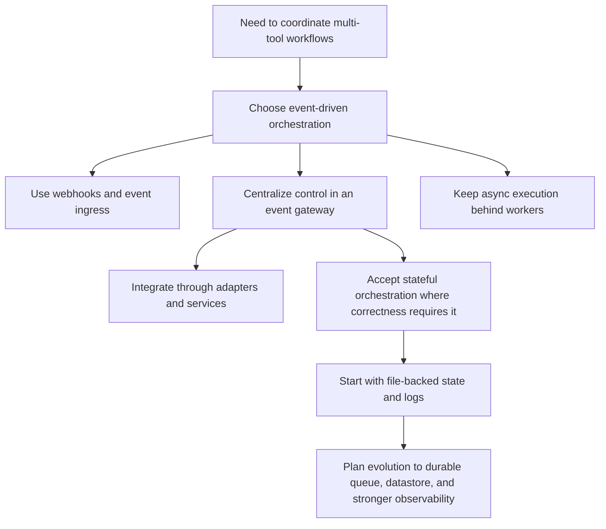

# Engineering Decisions

## Purpose of This Document

This document records the main engineering decisions behind the orchestration system and the trade-offs that come with them. The goal is not to justify the current implementation after the fact. The goal is to make the reasoning explicit so future engineers can understand:

- what problem each decision was trying to solve,
- which alternatives were considered,
- where the current design is intentionally conservative,
- and which parts should change as the system moves from a local-first implementation to a more production-oriented deployment.

Documenting decisions matters because orchestration systems accumulate complexity through integration behavior, failure handling, and operational edge cases. If that reasoning stays implicit, the codebase becomes harder to extend and easier to break in subtle ways.

## Key Decisions

### 1. Event-Driven Architecture Instead of Synchronous Tool-to-Tool Calls

#### Context

The system coordinates work across tools with different responsibilities and different runtime behavior. A task change in a tracker may lead to a Slack update, a queued task, a worker action, or all three. Those steps do not share the same latency, retry behavior, or delivery guarantees.

#### Decision

The system is organized around events and orchestration rather than direct synchronous calls between integrations.

#### Alternatives Considered

- Direct API calls from one tool integration to another
- A simple request-response workflow where ingress immediately performs every side effect inline
- A script-per-integration approach with minimal shared orchestration logic

#### Trade-offs

Benefits:

- clearer separation between event receipt and downstream execution,
- easier extension to new tools and event types,
- better support for asynchronous work,
- and a more natural place to apply retry, dedupe, and audit behavior.

Costs:

- more moving parts,
- more state to reason about,
- and a higher need for observability and correlation identifiers.

This is the right trade-off for a workflow system, but it increases operational complexity compared with a single direct integration.

### 2. Webhooks and Event Streams Over Polling as the Primary Ingress Model

#### Context

Development workflow updates are typically discrete changes that should be propagated quickly and with clear origin. Polling can detect those changes, but it does so indirectly and usually with worse latency and higher upstream load.

#### Decision

The architecture assumes webhook-style or event-driven ingestion as the primary path. Slack Socket Mode is the implemented example in the current repository. Linear webhook ingestion is the corresponding tracker-side design.

#### Alternatives Considered

- Periodic polling of tracker and chat APIs
- Hybrid design with polling as the primary source and events as a supplement

#### Trade-offs

Benefits:

- lower end-to-end latency,
- clearer mapping from upstream state transition to internal event,
- lower API overhead,
- and easier correlation for debugging.

Costs:

- webhook consumers must handle retries and duplicate delivery,
- ingress correctness becomes more important,
- and some reconciliation logic may still be needed because webhook systems are not perfect.

The system still may need polling later for reconciliation jobs, but polling is not the primary design center.

### 3. Central Event Gateway Instead of Direct Pairwise Integrations

#### Context

If Slack talks directly to Linear, Linear talks directly to workers, and workers talk directly back to Slack, workflow logic becomes fragmented across adapters. That makes it difficult to enforce consistent policy or explain why a given action happened.

#### Decision

Use a central event gateway and orchestration path that receives source-specific events, normalizes them, and routes them through a shared decision layer.

#### Alternatives Considered

- Pairwise direct integrations between each system
- A thin gateway with most logic embedded inside integration adapters
- Separate workflow logic per integration

#### Trade-offs

Benefits:

- shared routing and policy logic,
- less duplication of business rules,
- easier introduction of new integrations,
- and cleaner debugging because decisions happen in one place.

Costs:

- the central path becomes an important control point,
- it must be designed carefully to avoid becoming a monolith,
- and it requires a normalized event model to remain maintainable.

The gateway should centralize control flow, not absorb every implementation detail from every integration.

### 4. Adapter-Based Integration Strategy Instead of Embedding External API Logic Everywhere

#### Context

Each external tool has its own payload formats, authentication model, rate limits, and error behavior. If those details spread into orchestration code, the system becomes tightly coupled to specific vendors.

#### Decision

Integrations are handled through adapters or services with narrow responsibilities for ingress and egress behavior.

#### Alternatives Considered

- Direct API usage from orchestration code
- Shared helper functions without clear integration boundaries
- One large service that handles every tool's API details directly

#### Trade-offs

Benefits:

- clearer abstraction boundaries,
- easier mocking and testing,
- simpler replacement of one integration without rewriting core logic,
- and better long-term maintainability.

Costs:

- some additional abstraction overhead,
- risk of over-abstracting if adapters are designed too early,
- and the need to define what the normalized internal contracts should be.

This design assumes that abstraction cost is lower than the long-term cost of integration-specific coupling.

### 5. Stateful Processing for Correctness, with a Preference for Stateless Boundaries Where Possible

#### Context

A purely stateless event processor is simple to scale, but this system needs operational memory for dedupe, thread context, cooldowns, budget enforcement, queue state, and task confirmation flows.

#### Decision

The system accepts that parts of the processing path are stateful. Ingress and adapters should remain as stateless as practical, while orchestration and persistence own the minimum state necessary for correctness.

#### Alternatives Considered

- Fully stateless processing with no durable local state
- Fully stateful end-to-end services that embed transport, policy, and storage together

#### Trade-offs

Benefits:

- supports idempotency and workflow continuity,
- allows deferred execution,
- and makes confirmation flows and policy controls possible.

Costs:

- state management becomes an operational concern,
- concurrency is harder,
- and multi-instance deployment requires stronger coordination than the current file-backed model provides.

The current repository uses local files for this state. That is acceptable for a local-first runtime, but it is not the final form for a multi-worker production system.

### 6. File-Backed Local Persistence Before Durable Infrastructure

#### Context

The project is currently optimized for inspectability and rapid iteration. The main need is to make event boundaries and operational behavior explicit before introducing heavier infrastructure.

#### Decision

Use local file-backed persistence for tasks, runtime state, queues, and append-only operational logs.

#### Alternatives Considered

- Introduce a database and queue immediately
- Keep everything in memory and accept process-local volatility
- Use a database for state but not for logs

#### Trade-offs

Benefits:

- easy local development,
- transparent inspection of system state,
- low operational overhead,
- and faster iteration on event semantics.

Costs:

- weak concurrency guarantees,
- no strong queue semantics,
- limited replay support,
- and poor fit for multi-instance deployment.

This was a deliberate sequencing choice: make the control model concrete first, then harden the runtime when the workflow stabilizes.

### 7. Explicit Logging and Local Observability Instead of Relying on Console Output

#### Context

Event-driven systems fail in ways that are hard to reconstruct from transient logs. A missing notification may be caused by ingress filtering, dedupe suppression, queue failure, or downstream API errors.

#### Decision

Use append-only structured logs and derived observability views as first-class parts of the system.

#### Alternatives Considered

- basic console logging only
- ad hoc debug statements during development
- metrics without structured event correlation

#### Trade-offs

Benefits:

- easier debugging of multi-step workflows,
- better visibility into success and failure paths,
- practical local auditability,
- and a clearer path toward future tracing and metrics.

Costs:

- additional storage and code paths,
- the need to keep log schemas stable enough to remain useful,
- and possible drift between source logs and derived dashboards if caching is wrong.

The current logging model is intentionally simple, but it is materially better than treating observability as an afterthought.

### 8. Asynchronous Worker Execution Instead of Doing All Work Inline

#### Context

Some work initiated by an event is slow, failure-prone, or operationally separate from ingress. Inline execution would make ingress paths longer and harder to recover safely.

#### Decision

Use a worker boundary for deferred execution, queue-backed in the current model.

#### Alternatives Considered

- inline synchronous execution at ingestion time
- spawning best-effort background work without durable queue state
- embedding worker logic into the ingress process

#### Trade-offs

Benefits:

- ingress paths stay shorter,
- worker behavior can evolve independently,
- failures can be recorded separately,
- and future concurrency control becomes possible.

Costs:

- queue state must be managed,
- end-to-end flow becomes less linear,
- and correlation across ingress and worker boundaries becomes more important.

This is a standard distributed systems trade-off: operational complexity in exchange for better isolation and resilience.

## Integration Strategy

Integrations are handled through adapters or services because external systems should not define the internal architecture.

The adapter strategy provides several benefits:

- orchestration code can reason in terms of normalized events instead of vendor payloads,
- authentication and API-specific logic stay localized,
- ingress and egress behavior can be tested independently,
- and adding a new integration becomes a matter of implementing an adapter against an existing internal contract.

The abstraction is useful only if it remains honest. Adapters should not hide important semantics such as delivery guarantees, rate limits, or identifier models. The goal is not to pretend all integrations are identical. The goal is to isolate differences so they do not leak into every other layer.

## Scalability Decisions

The current architecture is intended to scale by separating responsibilities rather than by scaling the current file-backed runtime directly.

### How the System Can Scale

- ingress can scale as stateless receivers,
- orchestration can scale as independent processors over normalized events,
- workers can scale horizontally once queue semantics are durable,
- adapters can scale per integration type,
- and observability can move to a centralized telemetry pipeline without changing control flow.

### Assumptions Behind the Current Design

- event volume is currently low enough for local-first persistence,
- one or a small number of processes handle the active workload,
- strict global ordering is not required,
- and most workflows can tolerate eventual rather than immediate consistency across tools.

### Implications

The architecture itself is scalable. The current implementation is not yet production-scale infrastructure. That distinction is important. The design assumes the system will eventually move from:

- file-backed queue state to a durable queue,
- local runtime state to shared durable state,
- append-only local logs to centralized telemetry,
- and single-worker execution to controlled parallelism.

## Maintainability

The design favors maintainability through explicit boundaries and explicit state.

### How the Design Supports Future Changes

- orchestration logic is separated from transport concerns,
- integrations can be added or replaced behind adapter boundaries,
- operational state is visible rather than hidden in process memory alone,
- and event flow can be documented and debugged in terms of stable lifecycle stages.

### Adding New Integrations

The intended path for a new integration is:

1. define the source or destination boundary,
2. implement an adapter that handles tool-specific API behavior,
3. map tool-native payloads into the normalized event model,
4. route the new event types through existing orchestration logic where possible,
5. add any integration-specific observability and failure handling.

This is substantially easier than modifying direct pairwise integrations because the new tool is added at the edge rather than woven into the middle of every existing workflow.

## Known Limitations

The system is honest about what is not solved yet.

- There is no first-class durable event store.
- Replay tooling is limited.
- File-backed queues are not safe for high-concurrency workers.
- Multi-instance coordination is not solved by the current persistence model.
- Ordering guarantees are limited and mostly implicit.
- Some integrations, such as Linear, are architectural targets rather than completed implementations in this repository.
- Observability is useful locally, but not yet equivalent to production-grade tracing or metrics infrastructure.
- Failure handling exists, but retry policies and dead-letter behavior are still basic.

These limitations are acceptable for the current stage, but they are the first areas that would need hardening for production deployment.

## Future Improvements

Concrete next steps are clear.

- Define a first-class normalized event schema with versioning.
- Introduce a durable queue with explicit retry and dead-letter behavior.
- Move runtime and task state to a datastore that supports concurrent workers.
- Add replay and reconciliation tooling.
- Standardize correlation IDs across ingress, worker, and outbound delivery.
- Add per-integration health metrics and failure dashboards.
- Implement stronger ordering or stale-event protection where workflow correctness depends on it.
- Introduce more explicit integration contracts for tracker, chat, and agent adapters.

## Summary

The current design favors clear control flow, explicit state, and pragmatic local operability over premature infrastructure. The main decisions are not about using a specific framework or storage mechanism. They are about choosing an architecture that can absorb new integrations and more operational rigor without changing the system's core model.

The trade-offs are deliberate:

- more architectural structure than a simple automation script,
- less infrastructure than a production event platform,
- and a clear path between those two states.
