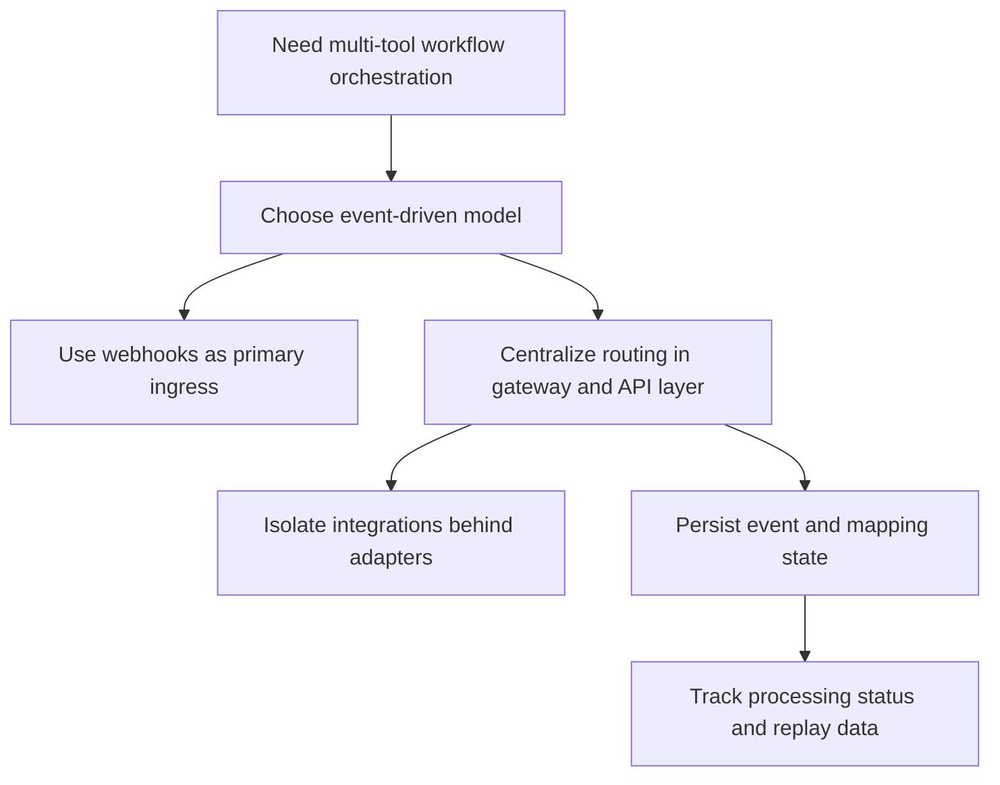

# Engineering Decisions

## Purpose of This Document

This document records the main technical decisions behind the orchestration platform and the trade-offs they introduce. The purpose is to keep architectural reasoning explicit so future changes can be evaluated against the original constraints instead of reverse-engineering intent from code alone.

That matters especially for integration-heavy systems. The difficult parts are usually not the API calls themselves. They are the decisions around boundaries, delivery guarantees, state, retries, and observability.

## Key Decisions

### 1. Event-Driven Orchestration Instead of Direct Synchronous Calls

Context:

- Slack, Linear, and agent workflows are asynchronous.
- A single change may require multiple downstream effects.
- Failures are often partial rather than all-or-nothing.

Decision made:

- model the system around events, routing, and downstream handlers instead of chaining direct calls between tools

Alternatives considered:

- direct Slack-to-Linear integration with no shared orchestration layer
- synchronous request-response workflows for every action
- separate automation scripts per integration path

Trade-offs:

- event-driven design improves extensibility and auditability
- it also increases the number of moving parts and the need for good observability

### 2. Webhooks as Primary Ingress, Polling Only for Reconciliation

Context:

- task and status changes are discrete events
- low-latency updates matter for Slack thread reporting and task coordination

Decision made:

- rely on Slack events and Linear webhooks as the primary event source

Alternatives considered:

- poll Linear and Slack on a fixed interval
- hybrid polling-first architecture

Trade-offs:

- webhooks reduce latency and API load
- they require stronger signature validation, retry awareness, and duplicate-event handling
- polling remains useful for recovery and reconciliation, but not as the main control path

### 3. Central Event Gateway Instead of Pairwise Tool Integrations

Context:

- if Slack, Linear, and agents call each other directly, workflow logic fragments quickly
- duplicate business rules become hard to trace and maintain

Decision made:

- centralize ingress and routing through gateway or API endpoints that hand events into shared processing logic

Alternatives considered:

- direct pairwise integrations between every participating system
- vendor-specific workflow logic embedded inside adapters

Trade-offs:

- centralization gives a single place for validation, routing, and policy
- it also creates an important control point that must not become a monolith

### 4. Adapters for Integration Boundaries

Context:

- Slack and Linear use different APIs, identifiers, rate limits, and payload structures
- those details change independently of workflow logic

Decision made:

- isolate integration-specific behavior behind adapters and helper modules

Alternatives considered:

- call vendor APIs directly from every route or worker
- keep only thin utility functions with no clear boundary

Trade-offs:

- adapters improve maintainability, testability, and replaceability
- they add abstraction overhead and require a stable internal contract

### 5. Stateful Processing Where Correctness Requires It

Context:

- thread mapping, stored events, replay, and report de-duplication require state
- a fully stateless design would be easier to scale but weaker operationally

Decision made:

- keep ingress relatively lightweight, but persist the minimum state needed for correctness and debugging

Alternatives considered:

- completely stateless handlers
- large stateful services that combine ingress, orchestration, and persistence tightly

Trade-offs:

- state improves replay, auditability, and workflow continuity
- it introduces concurrency, storage, and migration concerns

### 6. File-Backed Persistence as an Intermediate Stage

Context:

- the current system is still evolving
- local inspectability is valuable while behavior and schemas are being refined

Decision made:

- store event and mapping state locally in the current implementation instead of introducing a full production datastore and queue immediately

Alternatives considered:

- start with a database and queue from day one
- keep event state only in memory

Trade-offs:

- local files are simple and easy to inspect
- they are not appropriate for high concurrency, multi-instance coordination, or high-throughput replay

### 7. Append-Only Logging and Explicit Status Tracking

Context:

- integration failures are hard to debug if the system cannot show what it received and what it did with it

Decision made:

- record event status explicitly and keep enough raw payload history for replay and inspection

Alternatives considered:

- console logging only
- success-only metrics without payload-level audit

Trade-offs:

- explicit event state makes debugging and replay possible
- it increases storage and schema maintenance requirements

## Decision Diagram

## Integration Strategy

Integrations are handled through adapters and services because vendor APIs should not define the internal architecture.

Current benefits of that approach:

- Slack-specific details stay in Slack-facing modules
- Linear-specific details stay in Linear-facing modules
- routes can focus on validation and orchestration
- new integrations can be added by implementing new adapters against existing workflow expectations

Abstraction is useful here because the system needs stable internal semantics even when external APIs differ.

## Scalability Decisions

The current design assumes the architecture should scale by separating roles rather than by scaling the current local persistence model directly.

How the system can scale:

- ingress routes can scale independently
- adapter logic can remain thin and stateless where possible
- orchestration can move behind durable queues
- persistence can move from local files to a shared datastore
- replay and reporting can be backed by a proper event log

Current assumptions:

- event volume is still moderate
- most usage is development or early-stage operational traffic
- strict global ordering is unnecessary
- per-issue or per-thread correlation is more important than total system ordering

## Scalability Path

## Maintainability

The design supports future change in several ways:

- ingress, orchestration, integration, and persistence concerns are separate
- issue-thread mapping is explicit rather than implicit in message text
- event storage creates a durable debugging trail
- documentation and setup guides are kept in-repo near the implementation

Adding a new integration should follow the same pattern:

1. define ingress or egress boundaries
2. add an adapter for API-specific behavior
3. normalize identifiers and payloads
4. route through existing orchestration logic where possible
5. extend observability and replay behavior

## Known Limitations

The current system does not solve every production concern yet.

- event persistence is still lighter-weight than a true event store
- some anti-duplication and retry behavior is partial rather than comprehensive
- file-backed state is not a long-term multi-instance solution
- ordering guarantees are limited
- some architecture is split between the Next.js app and the `gateway/` workspace, which indicates an implementation transition still in progress
- replay exists conceptually and partially in code, but operational tooling is still limited

## Future Improvements

Concrete next steps:

- define a more explicit normalized event schema across integrations
- move stored event and mapping data into a shared datastore
- introduce queue-backed deferred processing where retry semantics matter
- improve duplicate-event protection per source
- unify gateway and app-level orchestration boundaries if both remain in use
- add stronger telemetry around failures, latency, and replay usage
- harden replay workflows so they are safe for repeated execution

## Summary

The current design favors correctness, traceability, and clear boundaries over minimal code surface. That is the right bias for an event orchestration system. The trade-off is that the implementation is still on the path from local-first tooling to production-grade event infrastructure. The architecture already points in the right direction; the remaining work is mostly in hardening durability, replay, and operational guarantees.
