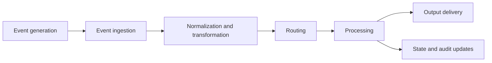
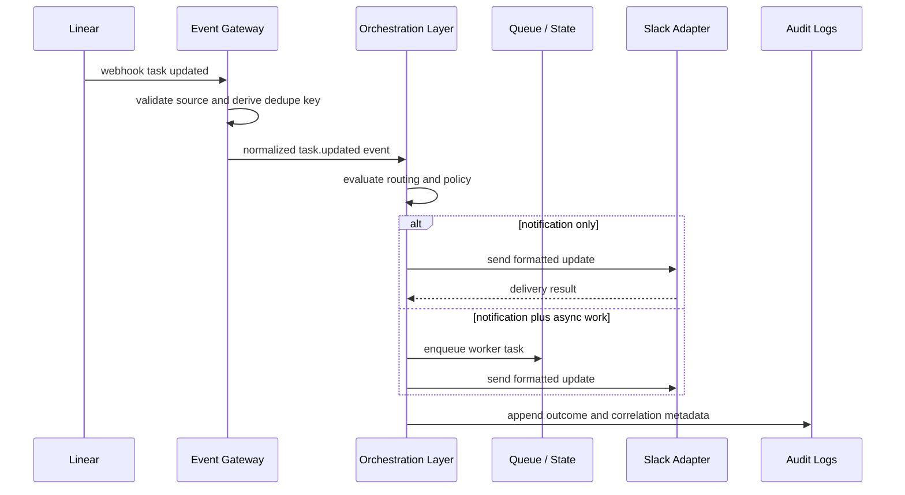
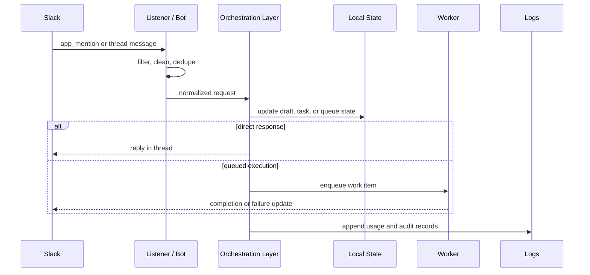

# Event Flow

## Overview

In this system, an event is a discrete signal that something relevant to the development workflow has happened and may require further action. Examples include:

- a task updated in Linear,
- a Slack mention requesting work,
- a thread reply confirming task creation,
- an agent or worker completing execution,
- or a downstream integration reporting a failure.

An event is not the same as a direct command. It is an observed state change or request that enters the system, carries context and identifiers, and is then interpreted by the orchestration layer.

The system uses an event-driven design because development workflows are naturally asynchronous and cross multiple tools. Direct API-to-API integrations tend to collapse event capture, business logic, and output delivery into one path. That approach is hard to scale and hard to reason about when failures occur. An event-driven model is used instead so the system can:

- accept input from multiple sources,
- normalize source-specific payloads into a stable internal shape,
- route processing based on event type and policy,
- perform asynchronous work without blocking ingress,
- and record outcomes for debugging and audit.

This repository currently implements Slack-originated event handling and local worker execution. Linear is part of the intended architecture and is used in this document as the representative tracker-based example flow.

## Event Lifecycle

The full lifecycle of an event can be described as six stages:

1. Event generation
2. Event ingestion
3. Normalization and transformation
4. Routing
5. Processing
6. Output delivery



### 1. Event Generation

An upstream system emits or exposes an event because something changed.

Examples:

- Linear emits a webhook when an issue changes status, assignee, or description.
- Slack emits an event when a user mentions a bot or replies in a tracked thread.
- A worker emits an execution result when it completes or fails a task.

At this stage, the event still belongs to the source system. Its schema, identifiers, and delivery guarantees are source-specific.

### 2. Event Ingestion

The event gateway receives the source-specific payload and performs the first correctness checks.

Typical ingestion responsibilities:

- verify that the source is allowed,
- validate request authenticity where applicable,
- reject unsupported event types,
- derive a deduplication key,
- capture correlation fields such as task ID, channel, or thread,
- and decide whether the event should enter the orchestration path.

The purpose of ingestion is not to implement workflow logic. Its role is to terminate transport-specific delivery and produce a clean handoff to the rest of the system.

### 3. Normalization and Transformation

Once accepted, the raw event is transformed into an internal representation that the orchestration layer can consume consistently.

Normalization typically includes:

- assigning an internal event type,
- extracting stable identifiers,
- mapping source-specific fields into canonical metadata,
- preserving the original payload or relevant subset,
- and attaching trace or correlation information.

This is the point where the system stops thinking in terms of "Slack event payload" or "Linear webhook body" and starts thinking in terms of internal semantics such as `task.updated`, `task.confirmed`, or `message.requested`.

### 4. Routing

Routing determines which workflow path should handle the normalized event.

Examples of routing decisions:

- a tracker update should notify a Slack channel,
- a Slack mention should create a pending task draft,
- a confirmation reply should commit a task to persistent state,
- a task-ready event should be enqueued for asynchronous execution,
- or a failure event should be recorded and escalated.

Routing is a control decision. It is where the system decides which component should act next.

### 5. Processing

Processing applies business rules and state transitions to the routed event.

Typical processing responsibilities:

- enforce idempotency rules,
- check cooldowns or policy gates,
- mutate task state,
- enqueue background work,
- invoke a model-backed agent path if appropriate,
- mark failures explicitly,
- and record processing outcomes.

This is the stage where the event causes durable effects rather than just moving through the pipeline.

### 6. Output Delivery

After processing, the system emits downstream effects.

Outputs can include:

- Slack notifications or thread replies,
- queue inserts for worker execution,
- task file updates,
- backlog updates,
- usage or audit log entries,
- or outbound updates back to a tracker such as Linear.

Not every event produces a user-visible output. Some events exist only to move internal state forward or to create an audit trail.

## Example Flow

This is the most important reference flow for understanding the system. It describes a tracker-driven event path using Linear as the upstream system and Slack as one downstream target.

### Example: Linear Task Updated



1. A task is updated in Linear.

The change could be a status transition, a reassignment, a priority change, or a description update. Linear emits a webhook event representing that state change.

2. The event gateway receives the webhook.

The gateway validates the request, checks the event type, and extracts source identifiers such as:

- Linear issue ID,
- webhook delivery ID,
- timestamp,
- project or team scope,
- and the changed fields.

3. The gateway derives a deduplication key.

This key should be stable enough to identify repeated deliveries of the same upstream event. It is used to prevent reprocessing when the upstream retries delivery or when the same event is observed more than once.

4. The raw payload is normalized.

The system converts the Linear-specific payload into an internal event structure, for example:

- `event_type = task.updated`
- `source = linear`
- `entity_type = task`
- `entity_id = linear_issue_123`
- `correlation_id = project_x:linear_issue_123`

The normalized event keeps the relevant payload details while removing the need for downstream components to understand Linear's native schema.

5. The orchestration layer evaluates routing rules.

Routing can depend on:

- which project the task belongs to,
- what field changed,
- whether the task is already associated with a Slack thread,
- whether an agent should be notified,
- or whether the change is informational only.

6. The event is classified into actions.

For example:

- send a Slack notification to a project channel,
- append a record to the audit log,
- enqueue a worker action if the status indicates implementation should begin,
- or ignore the event if it does not meet the routing criteria.

7. Downstream adapters perform outputs.

The Slack adapter posts a formatted message or thread reply. If asynchronous work is required, the queue layer persists a worker item. If local audit is enabled, a log record is appended.

8. The event result is recorded.

The system records whether processing succeeded, whether delivery was partial, or whether failure handling was required. This creates a traceable record for operators.

9. If processing fails, failure handling begins.

Depending on the failure mode, the system may:

- retry the outbound operation,
- mark the event as failed for manual inspection,
- record the error in audit logs,
- or leave the event eligible for safe replay.

### Same Control Pattern in the Current Repository

The current codebase demonstrates this same event lifecycle with Slack as the actual upstream source:

1. A user mentions the bot in Slack.
2. The Slack event is received and filtered.
3. The mention text is normalized into an internal request.
4. The orchestration layer decides whether to respond directly, create a task draft, or enqueue work.
5. State is persisted to local files.
6. Worker or bot outputs are sent back to Slack.
7. Audit and usage logs are appended for observability.

The important architectural point is that the control flow is the same even when the upstream tool changes.

### Repository Example: Slack-Originated Flow



## Event Structure

A typical event in this system should contain enough information to support routing, idempotency, debugging, and downstream processing.

### Typical Fields

- `event_id`
- `event_type`
- `source`
- `occurred_at`
- `received_at`
- `entity_type`
- `entity_id`
- `correlation_id`
- `dedupe_key`
- `metadata`
- `payload`

### Field Semantics

`event_id`

- A unique identifier for the event as represented internally.
- May be derived from the upstream delivery or created by the system.

`event_type`

- The normalized semantic type.
- Examples: `task.updated`, `message.mentioned`, `task.confirmed`, `worker.completed`.

`source`

- The upstream system or internal producer.
- Examples: `linear`, `slack`, `worker`, `agent`.

`occurred_at`

- When the upstream system says the event happened.

`received_at`

- When this system received the event.

`entity_type` and `entity_id`

- Identify the business object affected by the event.
- Examples: task, message thread, backlog item.

`correlation_id`

- Links related events together across systems.
- Useful for tracing a single workflow through tracker, chat, worker, and logs.

`dedupe_key`

- Used to prevent duplicate processing of the same upstream delivery.

`metadata`

- Small structured fields used for routing and diagnostics.
- Examples: channel ID, thread timestamp, project name, actor, delivery attempt.

`payload`

- The source-specific or normalized content needed to process the event.
- This is the data the processing layer actually reasons about.

### Example Normalized Event

```json
{
  "event_id": "evt_01HXYZ...",
  "event_type": "task.updated",
  "source": "linear",
  "occurred_at": "2026-03-21T15:04:12Z",
  "received_at": "2026-03-21T15:04:13Z",
  "entity_type": "task",
  "entity_id": "linear_issue_123",
  "correlation_id": "project-alpha:linear_issue_123",
  "dedupe_key": "linear:delivery_987654",
  "metadata": {
    "project": "project-alpha",
    "actor": "user_42",
    "delivery_attempt": 1
  },
  "payload": {
    "status_before": "Todo",
    "status_after": "In Progress",
    "assignee": "engineer_a"
  }
}
```

The current repository does not yet define a single first-class normalized event schema in code, but this is the level of structure the architecture assumes.

## Reliability Concerns

Event-driven systems must be designed around failure. The relevant concerns here are idempotency, duplicate delivery, retries, recovery, and ordering.

### Idempotency

The system should behave correctly when the same event is delivered more than once.

Practical implications:

- creating a task should not produce duplicate records,
- posting the same Slack notification twice should be prevented where possible,
- queue insertion should be guarded by stable event identity,
- and state transitions should tolerate redelivery.

In the current repository, this is partly handled through persisted event keys and queue deduplication.

### Duplicate Events

Duplicates are expected in real integrations, especially webhook-based ones. Sources may retry because they did not receive an acknowledgment, or the same logical change may surface through more than one channel.

The correct assumption is that duplicate delivery is normal, not exceptional.

### Retry Handling

Retries should be targeted, not blind.

Reasonable retry behavior:

- retry transient network failures,
- retry rate-limited outbound calls with backoff,
- do not retry malformed payloads,
- and make downstream side effects idempotent before adding automatic retries.

Retry policy belongs to the orchestration and worker boundaries, not inside every adapter independently.

### Failure Recovery

When processing fails, the system should preserve enough context to recover safely.

Good recovery behavior includes:

- recording the failure reason,
- preserving the event or queue item for inspection,
- avoiding partial silent success,
- allowing operators to identify whether ingress, routing, or delivery failed,
- and enabling safe replay where side effects are idempotent.

The current repository already records queue failure state and append-only usage logs, which is the correct direction even though replay tooling is limited.

### Event Ordering

Ordering may matter for some workflows and not for others.

Examples where ordering matters:

- a task should not be marked completed before it was created,
- a confirmation reply should not be processed before the pending draft exists,
- a stale tracker update should not overwrite a newer state transition.

In distributed systems, global ordering is expensive and often unnecessary. A more practical rule is to enforce ordering where it matters most:

- per task,
- per thread,
- or per correlation ID.

If strict ordering is not guaranteed, handlers must be written so they can detect stale or already-applied transitions.

## Event Persistence and Replay

Whether events are stored depends on the implementation stage.

### Current Local-First Model

The repository currently stores related operational artifacts rather than a full immutable event store:

- queue state in `tasks/slack_inbox.json`,
- task state in `tasks/tasks.json`,
- runtime state in `logs/architect_runtime_state.json`,
- append-only usage and outcome logs in `logs/ai_calls.jsonl`,
- and derived analytics in `logs/usage_cache.json`.

This is enough to support debugging and limited operational reconstruction, but it is not yet a full replayable event log.

### Debugging in the Current Model

Operators can debug by inspecting:

- whether the event was captured at ingress,
- whether a dedupe rule suppressed it,
- whether queue state changed,
- whether a worker produced an output or failure,
- and whether audit logs contain a corresponding execution record.

This provides practical traceability even without a dedicated replay service.

### Replay Model for a More Mature System

In a more developed deployment, replay should operate from a durable event record or queue history. Safe replay requires:

- stable event identity,
- idempotent handlers,
- clear separation of ingest timestamp from occurrence timestamp,
- and the ability to re-run processing without producing duplicate downstream effects.

Replay is useful for:

- backfills,
- recovery after downstream outages,
- regression testing of routing logic,
- and post-incident verification.

## Trade-offs

### Webhooks vs Polling

Webhooks are generally the better primary mechanism for this system because they provide:

- lower latency,
- less upstream API load,
- more precise change boundaries,
- and cleaner correlation to specific state transitions.

Polling still has a role in reconciliation and safety checks, especially if webhook delivery is lossy or if an upstream does not expose the required events. Polling is usually a supplement, not the primary event path.

### Event-Driven vs Direct API Calls

Direct API calls are simpler when one tool immediately triggers one action in another tool. That simplicity disappears once the workflow becomes conditional, asynchronous, or multi-step.

An event-driven design introduces more moving parts, but it provides:

- explicit control points,
- better failure isolation,
- easier extensibility,
- and a clearer audit trail.

For a system that coordinates tracker updates, chat notifications, agent work, and local state transitions, that trade-off is usually worth it.

## Summary

The system processes events by moving them through a consistent lifecycle: generation, ingestion, normalization, routing, processing, and output delivery. That lifecycle allows the orchestration logic to stay independent of any one tool while still preserving the metadata needed for reliability and debugging.

The current repository demonstrates this model with Slack-originated events, local persistence, and worker execution. The same event flow applies to a Linear-driven path once that adapter is implemented. The core design goal is not just to connect tools, but to handle their interactions in a way that remains auditable, extensible, and operationally predictable.
