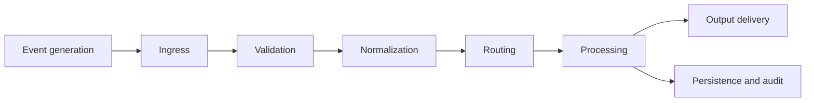
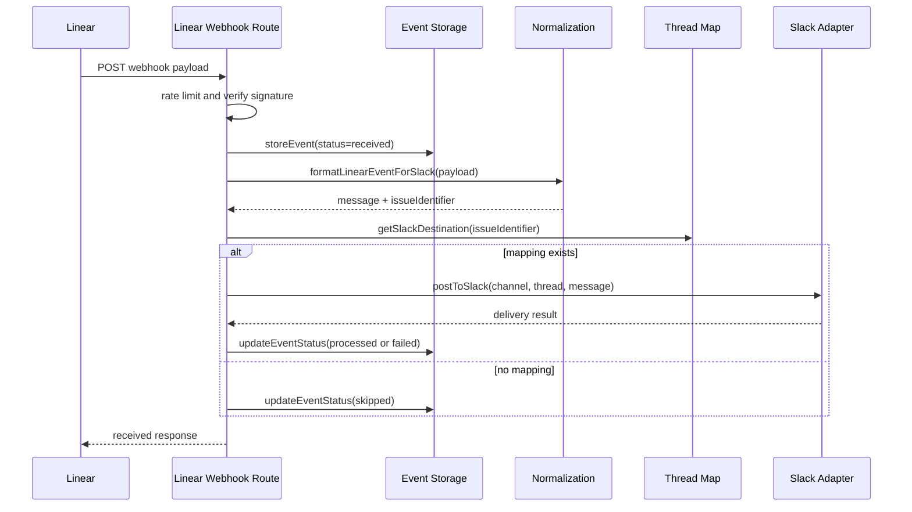

# Event Flow

## Overview

In this system, an event is a discrete signal that some workflow-relevant change has occurred and may require follow-up. Examples include:

- a Slack app mention requesting a task,
- a Linear issue update delivered by webhook,
- an agent status report sent to the reporting API,
- or a replay request against stored webhook history.

The system uses an event-driven design because the integrations are asynchronous by nature. Slack, Linear, and agent processes do not share a single execution context or delivery guarantee. Treating changes as events gives the system a stable lifecycle:

1. receive an event,
2. validate it,
3. normalize it,
4. route it,
5. perform side effects,
6. record the outcome.

That model makes it easier to reason about correctness, retries, and observability than direct one-off API calls between tools.

## Event Lifecycle

### 1. Event Generation

An upstream system generates a change notification or request.

Examples:

- Linear sends a webhook because an issue was updated.
- Slack sends an `app_mention` event because a user asked the bot to create work.
- An internal actor posts a report event to `/api/report`.

At this stage the event still uses the source system's schema and identifiers.

### 2. Event Ingestion

The system receives the raw event through an API route or gateway endpoint.

Current ingress points include:

- `src/app/api/slack/events/route.ts`
- `src/app/api/webhooks/linear/route.ts`
- `src/app/api/report/route.ts`
- `gateway/src/index.ts`

Ingress responsibilities:

- accept the request,
- enforce basic rate limiting,
- verify signatures when required,
- reject malformed or unsupported payloads,
- and capture the raw body for further processing.

### 3. Normalization / Transformation

After a request is accepted, the raw payload is converted into something the orchestration layer can use consistently.

Typical normalization work:

- extract the relevant entity identifier,
- determine the event type,
- derive routing context,
- map source-specific fields into a simpler internal shape,
- and preserve enough source metadata for later debugging.

Examples in the codebase:

- Slack mentions are parsed into task fields with `src/lib/slack-task.ts`
- Linear webhooks are formatted for Slack with `src/lib/linear-webhook.ts`

### 4. Routing

Routing determines what the system should do next.

Examples:

- a Slack mention should create a Linear issue,
- a Linear issue update should be posted to the mapped Slack thread,
- a report event should update the correct Slack thread for an existing issue,
- an unmapped Linear update should be recorded but skipped for delivery.

Routing is driven by identifiers and stored mappings rather than by source payload alone.

### 5. Processing

Processing applies workflow-specific behavior.

Typical processing steps:

- create a Linear issue,
- build a Slack message,
- look up an issue-thread mapping,
- persist an event record,
- mark an event as processed, skipped, or failed.

This is the stage where the system performs durable work and side effects.

### 6. Output Delivery

Once processing has decided on an outcome, the system emits downstream effects.

Examples:

- post a confirmation back to the Slack thread that created a task,
- post a Linear update back into the correct Slack thread,
- persist event status to local storage,
- or record a failure for later inspection or replay.

## Lifecycle Diagram

## Example Flow

## Example: Linear Issue Updated

This is the canonical event-driven flow in the current architecture.

1. A Linear issue changes state.

Linear emits a webhook delivery containing the issue identifier, event type, action, and issue payload.

2. The webhook reaches the Linear ingress route.

`src/app/api/webhooks/linear/route.ts` receives the request, applies rate limiting, reads the raw body, and verifies the webhook signature when configured.

3. The event is stored immediately.

The route persists the received payload through `src/lib/event-storage.ts` with status `received`. This creates an audit trail before any downstream side effects happen.

4. The payload is normalized for reporting.

`formatLinearEventForSlack` extracts the issue identifier and produces a message shape suitable for Slack delivery.

5. The routing layer resolves the Slack destination.

The system uses `src/lib/thread-map.ts` to find the Slack channel and thread associated with the Linear issue.

6. The system branches based on mapping availability.

- If a mapping exists, the event is routed to Slack delivery.
- If no mapping exists, the event is marked `skipped` and processing stops without failing the webhook.

7. Slack delivery is attempted.

The Slack adapter posts the message to the correct channel and thread.

8. Event status is finalized.

- successful delivery updates the stored event to `processed`
- missing mapping updates the stored event to `skipped`
- delivery failure updates the stored event to `failed`

9. The response is returned to the caller.

The webhook endpoint returns a machine-readable result indicating whether the event was received and whether it was posted or skipped.

## Sequence Diagram

## Secondary Example: Slack Mention Creates Linear Issue

The reverse path also exists.

1. A user mentions the Slack bot using the task format.
2. `src/app/api/slack/events/route.ts` verifies the Slack signature.
3. The route parses structured task fields from the message.
4. The Linear adapter creates a new issue.
5. The system posts a confirmation back to the originating Slack thread.
6. The issue identifier is mapped to that Slack thread for future Linear webhook delivery.

This flow is the reason thread mapping matters. It creates the correlation needed for later tracker-to-chat updates.

## Event Structure

A typical internal event record needs enough information to support routing, audit, and replay.

Representative fields:

- `id`
- `type`
- `action`
- `receivedAt`
- `issueIdentifier`
- `issueId`
- `status`
- `rawPayload`
- `error`

In the current repository, stored Linear webhook events follow the shape defined in `src/lib/event-storage.ts`:

- `id`: locally generated event identifier
- `webhookId`: upstream delivery identifier if present
- `webhookTimestamp`: upstream timestamp if present
- `receivedAt`: when this system stored the event
- `type`: event domain, for example issue
- `action`: event action, for example update
- `issueIdentifier`: human-facing issue key if available
- `issueId`: underlying Linear entity id if available
- `status`: `received`, `processed`, `skipped`, or `failed`
- `rawPayload`: full stored payload for inspection or replay
- `error`: failure reason when processing does not succeed

## Reliability Concerns

### Idempotency

The system must tolerate repeated deliveries of the same logical event.

Current design helps with this by:

- storing event history,
- keeping issue-thread mappings separate from transport handling,
- and treating missing mappings as `skipped` rather than hard failures.

The code does not yet implement a complete cross-system dedupe layer for every ingress path, so idempotency is still a design concern rather than a fully solved property.

### Duplicate Events

Duplicate delivery is expected, especially with webhooks. The correct posture is to assume:

- upstream systems may retry,
- network uncertainty may cause repeated deliveries,
- and Slack or Linear may surface equivalent state changes more than once.

Handlers should therefore avoid side effects that cannot be safely repeated.

### Retry Handling

Retries should be selective.

Good retry candidates:

- transient Slack API failures,
- temporary network errors,
- short-lived dependency failures.

Poor retry candidates:

- malformed payloads,
- invalid signatures,
- missing required identifiers.

The current repo records enough state to support manual retry or replay, but automatic retry policy is still basic.

### Failure Recovery

When processing fails, the system should make the failure inspectable rather than silent.

Current mechanisms include:

- `failed` event status,
- persisted raw payloads,
- explicit skipped status when routing prerequisites are missing,
- and replay endpoints for Linear webhook history.

### Event Ordering

Ordering matters mostly at the issue or thread level, not globally.

Examples:

- a Slack thread mapping must exist before later Linear updates can be posted to that thread,
- stale issue updates should not overwrite newer state if replay is introduced more broadly.

The current design relies on per-issue correlation rather than strict global ordering.

## Event Persistence / Replay

The system stores received Linear webhook payloads and their processing status in local persistent storage.

This supports:

- debugging,
- replay,
- reconciliation,
- and investigation of skipped or failed deliveries.

The current implementation is lighter than a full event store. It is sufficient for local development and controlled workflows, but a production-scale system would likely move this data to a database or queue-backed event log.

## Trade-offs

### Webhooks vs Polling

Webhooks are the right primary mechanism here because they:

- reduce latency,
- reduce upstream API load,
- preserve discrete state transitions,
- and support more precise auditability.

Polling is still useful for reconciliation, but not as the main flow.

### Event-Driven vs Direct API Calls

Direct API calls are simpler for one-step automations. They stop being simple when:

- multiple systems participate,
- retries matter,
- delivery can be partial,
- and events need audit and replay.

An event-driven design introduces more components, but it provides cleaner control points and more operational visibility.

## Summary

The system moves events through a clear lifecycle: generation, ingress, normalization, routing, processing, and delivery. The current repository already demonstrates that pattern for Slack task creation and Linear webhook reporting. The remaining work is less about inventing a new flow and more about hardening dedupe, retry, and persistence semantics around the flow that already exists.
