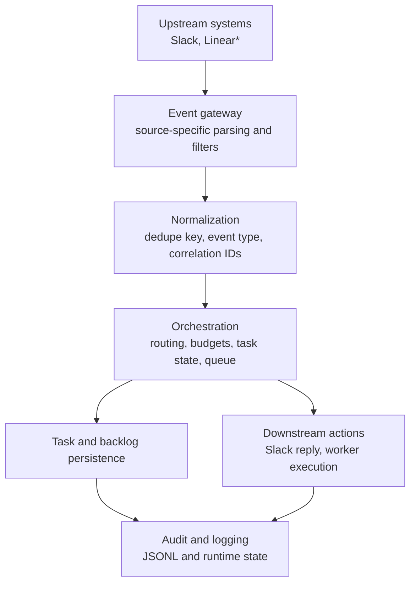

# AI Dev Team OS

AI Dev Team OS is a local-first orchestration system for development work that spans chat, task tracking, agent execution, and operational reporting. The repository is organized around events and state transitions rather than one-off scripts: a message, task request, or tool update is captured, normalized, recorded, and handed to a dedicated processing path.

The current codebase implements Slack-based intake, an Architect bot, a file-backed task and backlog store, an autonomous worker, and a web observability surface. The same boundaries are intended to support additional upstream systems such as Linear without changing the core processing model.

## Project Overview

Modern development workflows already produce a steady stream of machine-readable events: task updates, thread replies, assignment changes, agent results, and deployment signals. The hard part is not generating those events. It is coordinating them across systems with different APIs, different delivery guarantees, and different ideas of identity, threading, and failure.

That coordination is difficult for a few reasons:

- Development state is fragmented across tools. A task may begin in a tracker, move through a Slack thread, and end as a code change or review artifact.
- Tool-specific payloads are not interchangeable. A Slack mention, a Linear webhook, and a local worker result all carry different identifiers and semantics.
- Operational behavior matters. Duplicate deliveries, transient API failures, out-of-order updates, and partial execution are normal conditions, not edge cases.

An event-driven approach fits this problem because it separates event capture from decision-making and from side effects. Instead of tightly coupling "receive request" with "perform action immediately," the system can:

- accept input from multiple tools,
- normalize it into a stable internal shape,
- route it through explicit processing rules,
- record what happened for audit and replay,
- and perform downstream actions such as backlog mutation, Slack replies, or agent execution.

That model is easier to extend than a collection of direct tool-to-tool scripts, and it makes operational behavior visible.

## Core Architecture

The repository is structured as a set of clear boundaries rather than a monolithic bot.

| Component | Responsibility | Current implementation |
| --- | --- | --- |
| Event ingestion / gateway | Accept inbound events, validate source context, derive dedupe keys, and convert tool-specific input into internal requests. | Slack Socket Mode listeners in `src/slack/architect_bot.ts` and `scripts/slack-listen.js` |
| Integration adapters | Encapsulate external APIs for inbound and outbound communication. | Slack listener and poster modules in `src/lib/slack/` |
| Orchestration / processing | Apply routing rules, confirmation flows, cooldowns, daily budgets, queue claiming, and task transitions. | `src/slack/framework.ts`, `src/lib/slack/task-queue.js`, `src/lib/tasks/store.ts`, `scripts/slack-worker.js` |
| Persistence / audit | Store durable local state for tasks, queue entries, runtime dedupe state, budgets, and append-only usage logs. | `tasks/*.json`, `logs/*.json`, `logs/ai_calls.jsonl`, `brain/*.md` |
| Operator surfaces | Provide local visibility into planning state and runtime behavior. | `/brain` and `/observability` Next.js routes |

### Event Ingestion / Gateway Layer

The gateway layer terminates external events and makes the first correctness decisions:

- channel allow-listing,
- bot-message filtering,
- thread scoping,
- event deduplication keys,
- and extraction of task intent from human text.

In the current repository, Slack is the implemented ingress path. The Architect bot handles `app_mention` and thread follow-up messages. A separate listener accepts Slack mentions and converts them into queued work items for the autonomous worker.

If a Linear adapter is added, it belongs at this same boundary. Its job would be to accept webhook deliveries, verify them, and emit the same normalized internal event shape that Slack handlers already feed into the rest of the system.

### Integration Adapters and Services

Adapters are deliberately narrow. They should only know how to talk to external systems, not how to run the business process.

Current examples:

- `src/lib/slack/poster.js` posts outbound messages and thread replies.
- `scripts/slack-listen.js` converts Slack mention payloads into queued task records.
- `src/slack/architect_bot.ts` wraps Slack event intake around an architect-specific processing flow.

This separation matters because inbound transport, orchestration logic, and downstream side effects evolve at different rates. A new tracker adapter or notification destination should not require rewriting the core processing rules.

### Internal Orchestration Layer

The orchestration layer is where the system decides what an event means and what should happen next.

Current responsibilities include:

- deduplicating already-processed Slack events,
- keeping thread-local cooldown state,
- enforcing a daily call budget for model-backed Architect responses,
- staging task drafts that require human confirmation,
- appending confirmed tasks into persistent backlog storage,
- claiming pending queue items for worker execution,
- and transitioning task state through pending, processing, done, or failed.

This logic is intentionally separate from the transport layer. That makes it easier to reason about correctness and to port the same policies across different upstream sources.

### Persistence and Audit Layer

The repository currently uses file-backed local persistence. That is a deliberate choice for a local-first integration system, but the files are structured in a way that reflects production concerns:

- `tasks/slack_inbox.json` is the worker intake queue.
- `tasks/tasks.json` is the persistent task list created through the Architect flow.
- `brain/BACKLOG.md` is a human-readable planning surface that also participates in automation.
- `logs/architect_runtime_state.json` stores processed event keys, active thread state, and pending task drafts.
- `logs/budget_daily.json` stores daily Architect call counts.
- `logs/ai_calls.jsonl` is the append-only operational log for model usage and execution outcomes.
- `logs/usage_cache.json` is a derived cache used by the observability dashboard for incremental reads.

This is not a database-backed event store, but it does establish the right boundaries: operational logs are append-only, runtime state is explicit, and derived analytics are cached separately from source records.

## Event Flow

The system is built around a standard event pipeline:

1. capture an external event,
2. normalize it into an internal representation,
3. route it through the orchestration layer,
4. perform downstream actions,
5. record the result for audit and debugging.

### Representative End-to-End Flow

The current repository demonstrates this pattern with Slack as the implemented source. The same pattern applies to a work-tracker adapter such as Linear.

Example flow for a tracker-driven notification path:

1. A task is updated in Linear.
2. A Linear webhook delivers the update to the event gateway.
3. The gateway verifies the request, extracts identifiers, and maps the payload into a normalized internal event such as `task.updated`.
4. The orchestration layer evaluates routing rules: which project, channel, or downstream agent should react to this update.
5. The Slack adapter formats the resulting notification and posts it to the appropriate thread or channel.
6. The system records the event handling result and any downstream call metadata so operators can audit what happened.

That same pattern is visible today in the Slack-driven path already implemented in this repository:

1. A user mentions the bot in Slack.
2. The Slack listener captures the event and derives a stable event key.
3. The mention text is cleaned and transformed into a task request or an Architect prompt.
4. The orchestration layer decides whether the event should create a pending task draft, append a confirmed task to the backlog, enqueue autonomous work, or trigger a direct in-thread Architect response.
5. The worker or poster module performs the downstream action.
6. Usage and result metadata are appended to the local operational log.

### Simple Event Diagram



`(*)` Linear is an architectural adapter target, not a completed integration in the current repository.

## Reliability and Operational Concerns

Event-driven systems are defined as much by their failure modes as by their happy paths. This repository already includes several reliability-oriented behaviors and exposes where stronger guarantees would be needed as the system grows.

### Idempotency

The system should assume that upstreams can redeliver the same event. Current mechanisms include:

- processed Slack event keys persisted in `logs/architect_runtime_state.json`,
- queue deduplication by `eventKey` in `src/lib/slack/task-queue.js`,
- and thread-scoped task draft storage to avoid repeatedly creating the same backlog item during a confirmation flow.

Idempotency needs to be evaluated per side effect. Posting to Slack, writing a task file, mutating a backlog, and calling a model all have different failure windows.

### Retries and Duplicate Events

Webhook and Socket Mode consumers must expect duplicates and transient failures. The current worker records attempts and terminal states, but retry policy is still simple. For a higher-assurance deployment, retries should be explicit and differentiated:

- retry transport errors and rate limits,
- avoid retrying malformed payloads,
- and make downstream writes idempotent before enabling automatic replay.

Without that distinction, retries can amplify duplicate work.

### Failure Handling

The current design makes failures visible instead of silently dropping them:

- queue items move to `failed` with the last error recorded,
- Slack worker exceptions attempt to report failure back to the originating thread,
- model-call failures are logged with `success=false` and an `error_code`,
- and unsupported autonomous task types are rejected explicitly.

That is the correct default posture for orchestration systems. Silent partial failure is worse than loud failure because it destroys operator trust.

### Persistence, Auditability, and Replay

The repository has the beginnings of an audit trail:

- append-only model usage in `logs/ai_calls.jsonl`,
- durable queue and task snapshots in `tasks/`,
- and durable runtime state for dedupe and cooldown decisions.

Replay support is still limited. Operators can inspect files and reason about prior execution, but there is no dedicated replay tool that can safely re-run a historical event stream. As event volume increases, replay tooling becomes necessary for recovery, regression testing, and backfills.

### Why Webhooks Beat Polling Here

For development workflow coordination, webhook-style delivery is usually preferable to polling:

- lower latency from user or tracker action to automation response,
- lower load on upstream APIs,
- easier correlation to a specific state transition,
- and a clearer audit trail of discrete event deliveries.

Polling can still be useful for reconciliation jobs, but it is a poor primary mechanism for high-context workflows where thread timing and exact change origin matter.

## Scalability Considerations

The current implementation is intentionally simple and local-first. That makes it easy to understand and operate, but the scaling constraints are clear.

### How the System Can Scale

The boundaries already support independent scaling of major responsibilities:

- ingress can scale as stateless event receivers,
- orchestration can scale as separate workers consuming normalized events,
- downstream adapters can scale by destination or integration type,
- and observability can scale independently from ingestion because it reads derived logs rather than intercepting live traffic.

### Current Bottlenecks

The present repository will hit limits in predictable places:

- file-backed queues do not provide safe concurrent consumers,
- synchronous file writes create contention under higher throughput,
- runtime state is process-local plus file-backed, which complicates multi-instance deployment,
- the autonomous worker is effectively single-threaded,
- and observability depends on local log files rather than a centralized telemetry pipeline.

Those are acceptable trade-offs for a local orchestration workspace, but they are not hidden. They define the point at which a queue, database, or durable event log becomes necessary.

### Trade-offs at Higher Volume

Moving from files to infrastructure improves throughput and failure recovery, but it also changes the complexity profile:

- a durable queue adds operational overhead but gives explicit retry and dead-letter behavior,
- centralized state improves concurrency safety but requires schema management,
- and richer event schemas improve routing accuracy but raise versioning costs.

The right move depends on whether the system remains a single-team control plane or becomes shared infrastructure across multiple repos and toolchains.

## Observability and Debugging

An orchestration system is only operable if events can be followed end to end.

The current repository already has a workable local observability model:

- `logs/ai_calls.jsonl` captures append-only execution metadata,
- `logs/usage_cache.json` incrementally materializes analytics for the web dashboard,
- `/observability` exposes token, call, role, action, and task-level breakdowns,
- `channel_id`, `thread_ts`, and `task_id` act as correlation fields across logs,
- and runtime state files make dedupe and cooldown decisions inspectable.

For debugging, this matters in concrete ways:

- if an integration fails, the operator can see whether the event was captured at all,
- if a model call fails, the error code and latency are recorded,
- if a Slack action appears to be missing, the queue and runtime state can show whether it was deduped, blocked by budget, or marked failed,
- and if analytics appear stale, the source log and derived cache can be compared directly.

As the system matures, the next observability step would be structured tracing across ingestion, orchestration, and side effects. Even in the current file-backed model, the design already benefits from correlation identifiers and append-only logs instead of opaque console output alone.

## Example Use Case

One realistic workflow already supported by the repository looks like this:

1. A team member mentions the Architect bot in Slack and asks for a concrete implementation task.
2. The bot inspects the thread context, detects task intent, and creates a pending task draft instead of immediately mutating state.
3. After explicit confirmation, the task is appended to `tasks/tasks.json` and mirrored into `brain/BACKLOG.md`.
4. The autonomous worker polls for pending work, claims a task, and executes the supported action path.
5. The worker posts a completion or failure update back to the same Slack thread.
6. Model usage and runtime outcomes are appended to `logs/ai_calls.jsonl`, and the `/observability` route reflects that activity.

What matters here is not the specific supported task type. It is the control flow:

- human intent is captured as an event,
- state mutation is explicit,
- automation runs asynchronously,
- and the system leaves behind enough evidence to explain what happened afterward.

That is the core value of the design.

## Design Trade-offs

### Event-Driven vs. Synchronous Workflows

An event-driven design is better for long-running, cross-tool workflows because it decouples ingestion from execution and makes retries or later routing decisions possible. The cost is that state becomes distributed across queues, logs, and handlers instead of existing in one linear request path.

### Flexibility vs. Simplicity

Adapters, normalized events, and explicit routing rules make the system extensible. They also introduce more moving parts than a direct script that reacts to a Slack message and immediately performs work. The repository favors flexibility because development operations inevitably expand to more tools and more event types.

### Operational Complexity vs. Automation Benefits

Automation reduces manual coordination, but only if operators can trust it. That trust requires idempotency, audit logs, failure visibility, and replay strategy. The current project accepts some implementation simplicity by using local files, while still shaping the code around the concerns a more durable deployment will need.

## Local Development

### Prerequisites

- Node.js 20 or newer
- npm
- A Slack app configured for Socket Mode if you want to run the bot or listener paths
- An OpenRouter API key if you want model-backed Architect responses

### Install

```bash
npm install
```

### Environment Variables

For the web UI alone, no external credentials are required.

For the Architect bot:

```bash
ARCHITECT_SLACK_BOT_TOKEN=
ARCHITECT_SLACK_APP_TOKEN=
ARCHITECT_ALLOWED_CHANNELS=
OPENROUTER_API_KEY=
ARCHITECT_MODEL=
OPENROUTER_MODEL=
MAX_OUTPUT_TOKENS=600
ARCHITECT_DAILY_CALL_CAP=120
ARCHITECT_ALLOW_DM=false
ARCHITECT_THREAD_COOLDOWN_SECONDS=600
ARCHITECT_MAX_THREAD_HISTORY_MESSAGES=20
```

For the Slack intake listener and worker:

```bash
DEV_SLACK_BOT_TOKEN=
DEV_SLACK_APP_TOKEN=
DEV_SLACK_CHANNEL_ID=
DEV_SLACK_ALLOWED_CHANNELS=
SLACK_WORKER_POLL_MS=2500
```

Optional outbound posting defaults:

```bash
SLACK_BOT_TOKEN=
SLACK_APP_TOKEN=
SLACK_CHANNEL_ID=
```

### Run Locally

Start the web UI:

```bash
npm run dev
```

Useful routes:

- `http://localhost:3000/brain`
- `http://localhost:3000/observability`

Run the Architect bot:

```bash
npm run slack:architect
```

Run the Slack listener and autonomous worker:

```bash
npm run slack:listen
npm run slack:worker
```

### Validation Commands

Lint the codebase:

```bash
npm run lint
```

Append a synthetic observability record:

```bash
npm run log:test
```

Production build check:

```bash
npm run build
```

## Future Improvements

Reasonable next steps for this repository are mostly about strengthening durability and operator tooling rather than adding superficial features.

- Introduce a first-class normalized event schema with versioning so adapters can evolve independently.
- Add replay and backfill tooling for historical event streams and failed queue items.
- Replace file-backed queue semantics with a durable queue once multi-worker concurrency matters.
- Add richer dashboards for queue depth, failure rate, retry volume, and per-integration health.
- Expand integration coverage at the adapter boundary, including a work-tracker webhook path such as Linear.
- Improve failure recovery with explicit retry classes, dead-letter handling, and reconciliation jobs.
- Promote correlation IDs and structured tracing across ingestion, routing, and side effects.

## Repository Notes

This repository is intentionally local-first and uses on-disk files as the primary persistence layer. That keeps the system inspectable during development and makes the event boundaries easy to understand. It also means the current implementation should be read as a serious orchestration design with a pragmatic local runtime, not as a claim of production-hard infrastructure already being present.
